# **Rendy Devara**  
[📧 rendy_devara@msn.com](mailto:rendy_devara@msn.com) | [🔗 LinkedIn](https://www.linkedin.com/in/rendy-devara-42bb861a2/) | [🐙 GitHub](https://github.com/devararendy) | [☎️ (+62)81285960935](https://wa.me/6281285960935)

---

## **👤 Profile**  

    
    

        <ul>
            <li><b>Full Name:</b> Rendy Devara</li>
            <li><b>Email:</b> <a href="mailto:rendy_devara@msn.com">rendy_devara@msn.com</a></li>
            <li><b>Nationality:</b> Indonesian</li>
            <li><b>Phone Number:</b> (+62)81285960935</li>
        </ul>
    

---

## **📝 Professional Summary**

Versatile software and hardware developer with 8+ years of experience in building scalable systems and leading technical teams. Expertise in developing high-performance applications (150,000 orders/sec), designing embedded systems, and creating innovative solutions for fintech and IoT industries.

---

## **💡 Skills**

- **Programming Languages:** Golang, C++, C, Python, Protobuf, Bash Script (Linux / Unix), Markdown
- **Communication Protocol / Interface:** TCP, UDP, REST APIs, GRPC, MQTT, UART, SPI, I2C, LORA
- **Embedded System:** Raspberry Pi, ESP32, ESP8266, STM32, AVR
- **Hardware:** PCB Design (EagleCAD, KiCad), 3D Design (Fusion360), UV 3D Printing, CNC Machining
- **Frameworks & Tools:** QT Creator, Docker, Git, Arduino, mbedOS, STM32CubeIDE
- **Message Queue:** Redpanda, ZeroMQ, NanoMsg
- **Databases / Cache:** MySQL, PostgreSQL, Redis
- **Other Skills:** Agile Development, Unit Testing, Video Editing (Final Cut Pro)

---

## **🏢 Professional Experience**

### **Senior Backend Engineer**
**Stockbit.com** | 📍 Jakarta, Indonesia  
*Dec 2021 – Present*  
- Developed Exchange Core (matching engine) adopting LMAX architecture using C++17, capable of handling 150,000 orders per second.
- Created development tools for Unix/Linux-based systems.
- Built services for stock exchanges using Golang.

### **Firmware Engineer**
**PT Mecoindo - Itron** | 📍 South Cikarang, Indonesia  
*Sept 2020 – Nov 2021*  
- Designed firmware and applications for Smart Electric Meters and Modems using Python for Linux user space.
- Created custom Linux builds for embedded systems (Buildroot & Yocto).
- Developed Unix/Linux-based tools.

### **Senior R&D Engineer (Team Leader)**
**Ishaan Informatics Pte. Ltd.** | 📍 Jakarta, Indonesia  
*Sept 2017 – Jul 2020*  
- Led a team of 6 engineers to develop airline electronics.
- Designed and prototyped new electronic products for airline projects, such as eTag (Electronic Baggage Tag), BLE Beacon, ePass (Electronic Boarding Pass), including PCB design and layout.
- Implemented RESTful APIs for interfacing hardware with mobile apps and backends.
- Conducted thorough testing using oscilloscopes, DMMs, and antenna analyzers.

---

## **⏳ Part-Time Experience**

### **RF Engineer**
**OS-Wifanusa** | 📍 Bandung, Indonesia  
*Jan 2016 – Jun 2016*  
- Developed radio frequency communication devices and battery packs with integrated management systems.

### **Embedded System Engineer**
**Homebrew Partner** | 📍 Jakarta, Indonesia  
*Nov 2014 – Jan 2016*  
- Designed microcontroller firmware for controlling amateur radio interfaces.

---

## **🎓 Education**

### **Bachelor of Computer Engineering**
**BINUS University** | 📍 Jakarta, Indonesia  
*Jun 2013 – Aug 2017*  
- Graduated with honors (GPA: 3.36/4.0)  
- Major: Embedded Systems  
- Relevant Courses: Hardware Engineering, Software Engineering, Data Structures, Algorithms, Database Systems

---

## **🛠️ Projects**

### **Bot Telegram Near ARA Stock (IDX)**
- Built a bot to fetch and filter stocks potentially reaching ARA (max price of the day). Assisted traders in making data-driven decisions by providing timely alerts and critical stock insights. Included information such as Best Bid, Best Ask Price and Volume, Latest PBV, and Percent Gain. Developed in Golang.

### **Truck Scale Software**
- Developed a cross-platform GUI application in C++ for truck weight measurement with integrated features such as digital scale readings, ticket printing, comprehensive reporting, and user account management. Enhanced functionality by incorporating USB camera support to capture and embed truck images into reports during the weighing process.

### **Drone Delivery Service**
- Designed and developed drones from schematics, PCB design, and firmware for aerial package delivery. Capable of carrying 2kg payloads. Firmware written in C++. The quadcopter uses 17-inch carbon propellers and brushless motors for improved energy efficiency. Utilized multiple sensors (gyroscope, accelerometer, magnetometer, barometer, GNSS) with sensor fusion for precise position estimation. Powered by a high-density lithium-ion battery to maximize flight time.

### **FPV Drone**
- Built FPV drones for hobbies and clients, including tiny whoops, 3-3.5 inch whoops, freestyle 5-inch, race drones, and long-range VTOL drones. Equipped with the latest Radio Control protocol (ELRS) for extended range, digital video transmission for clear pilot visuals, and failsafe features with GNSS UBlox M10 for emergency Return to Home functionality. Fully tested before handover to clients.

---

## **🏆 Awards**

- **Technical Award** – The 13th International Robot Olympiad (2011)  
- **2nd Place** – Autonomous Sumo Robot, Robotic Day (2011)  
- **1st Place** – Autonomous Sumo Robot, Robotic Day (2012)  
- **1st Place** – Line Follower Robot, Pesta Rakyat Fisika UI (2011)

---

## **🎨 Interests**

- Open-source contributions
- Stock investment and trading
- Robotics, drone development for industrial applications, and FPV drone innovation

---

## **💼 Portfolio**

Welcome to my portfolio! Here are my featured projects:

### **📁 5-inch Freestyle FPV Drone**

    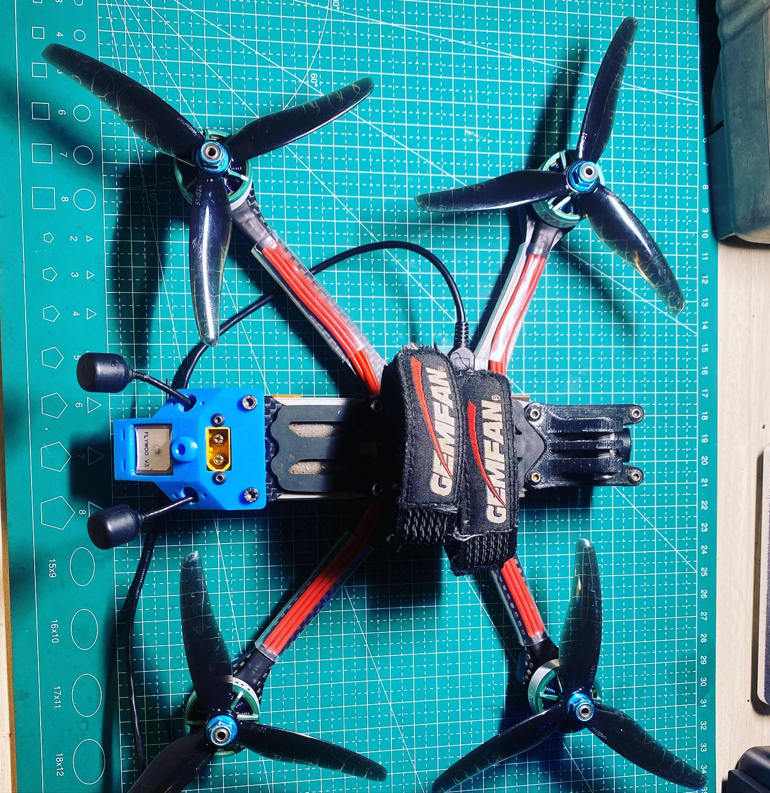
    

        

            A FPV Drone that use STM32 as a brain Consist of FPV Camera with HD DVR, STM32 microcontroller, IMU, GNSS Ublox M10, 32bit ESCs, Brushless Motors. Able to Fly Acrobatics over +120km/h and has Return To Home Failsafe capability.
        

    

### **📁 24invitation.com - Digital Invitation Service**

    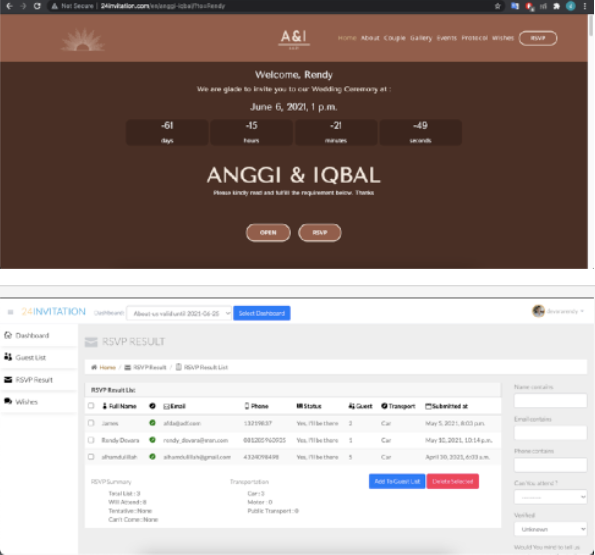
    

        

            A Website that provide You a Digital Invitation service.
            This a new era for inviting Your beloved guest to Your best Wedding Party. With this website You can easily manage your guest, see their best wishes for You. You can manage it thru Your own dashboard.
            This Website is using Django as a backend.
        

    

### **📁 TruckScale Software**

    
    

        

            A GUI Software for Measure Truck Weight & Print Ticket.
            This Software will connect to digital weight scale + load cell sensor. This software will get the weight and print tickets for the Company of each Truck.
            It use encrypted SQL to ensure the data is safe and secure. The user access also can be configured.
            This software can be deployed to macOS, Linux, Windows. This was written in C++
        

    

### **📁 ESP32 Tiny Drone**

    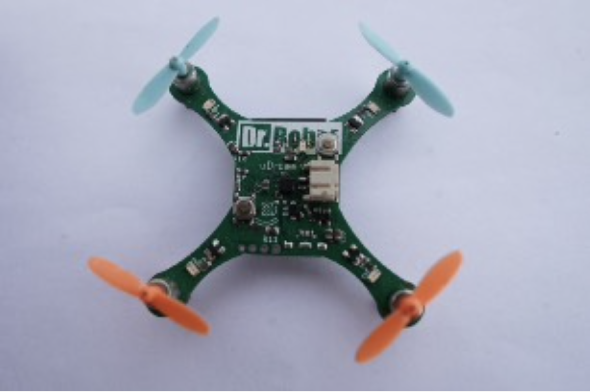
    

        

            A tiny Quadcopter that use ESP32 as a brain. 
            Consist of ESP32 microcontroller, IMU MPU9250 contains Accelerometer, Gyroscope, Magnetometer in single chip, IR VL53l0X sensor for calculating height above ground. The purpose of this drone is to let people learn how to program a drone.
        

    

### **📁 NanoDLP UV 3D Printer Controller**

    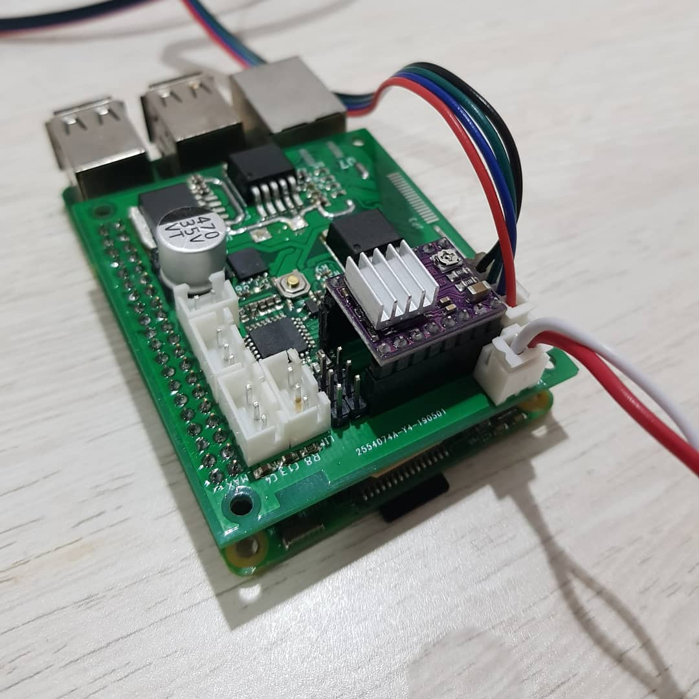
    

        

            A Nano DLP Shield for Raspberry Pi.
            Consist of DRV8825 for driving Z axis, DC booster for driving 50 watt UV LED and atmega8 as a GRBL controller
        

    

### **📁 SDEx 32bit Flight Controller**

    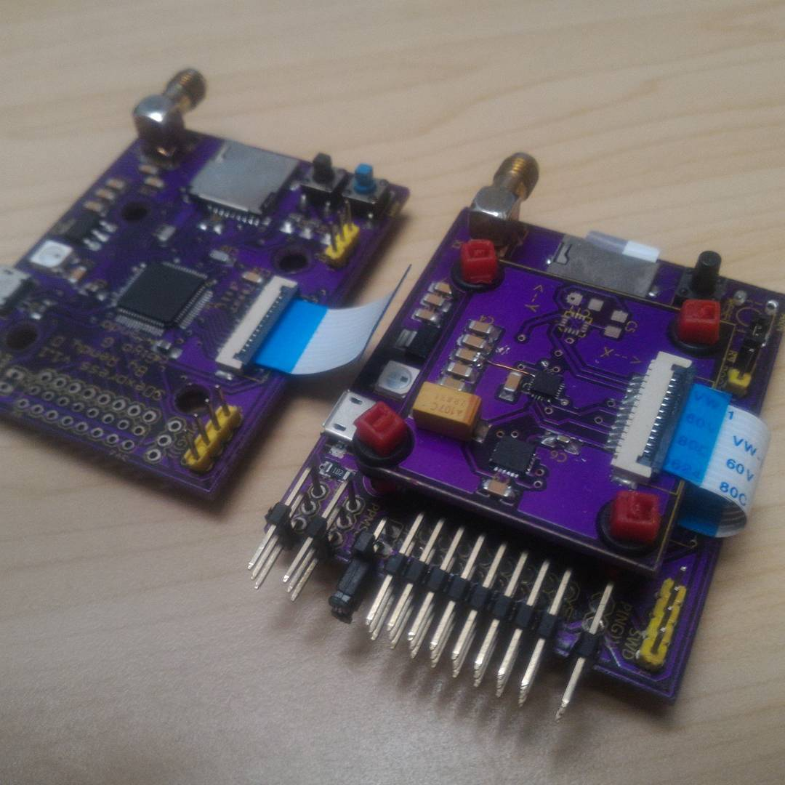
    

        

            A DIY Flight Controller of Smart Drone Express.
            Consist of STM32F446RE microcontroller, IMU MPU9250, Barometer MS5611. Programmed in System Workbench (Eclipse Based) C++ with mBed OS (Exported to local file)
        

    

### **📁 SDEx Drone Delivery**

    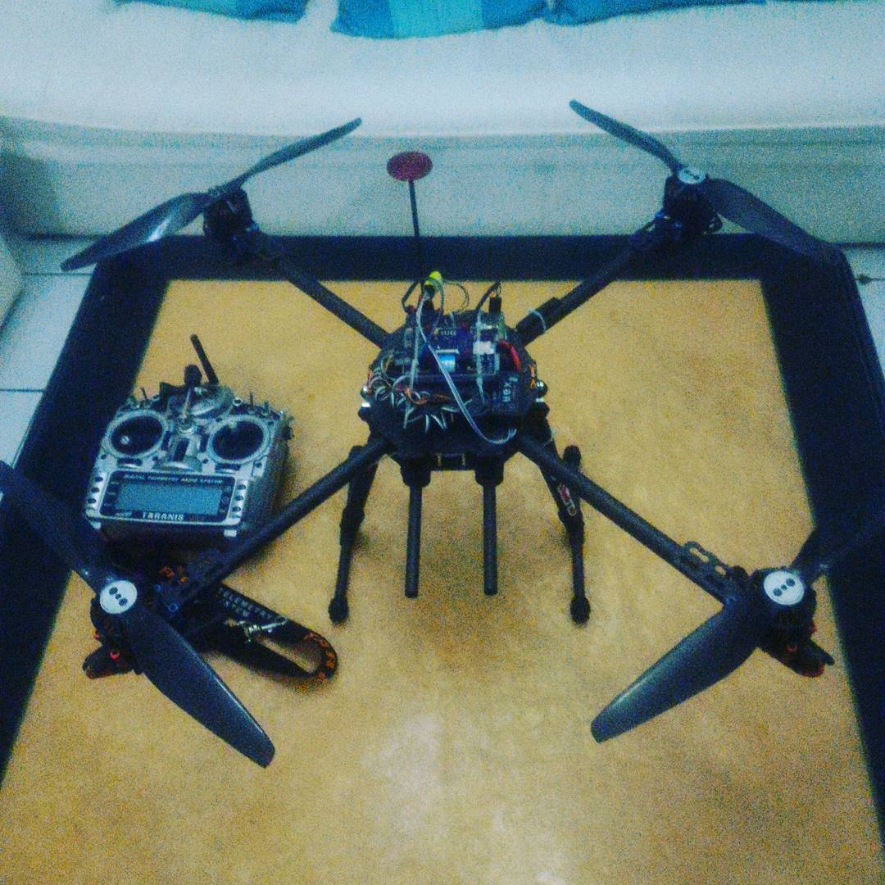
    

        

            A Drone for Delivering Package.
            Consist of the DIY Flight Controller (inside the black box), Carbon Frame, Brushless motor, ESCs, 17” Carbon Propellers, Li-Ion Battery Pack 6s2p.
        

    

### **📁 U-Copter Drone**

    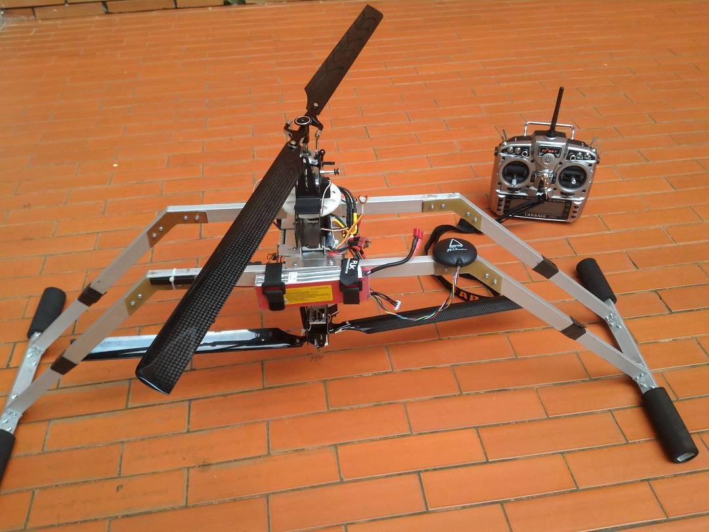
    

        

            An Uni-Copter Drone.
            Similar to Co-axial helicopter, it uses 2 rotors CW and CCW. It Consist of 2 Brushless motors, 6 servos for controlling 2 swashplates, GNSS, Pixhawk Flight Controller, Raspberry Pi 2, Long Range WiFi 2.4GHz WN7200ND and Pi Camera. 
        

    

### **📁 BINUS - SR01 KRPAI Fire Fighting Robot**

    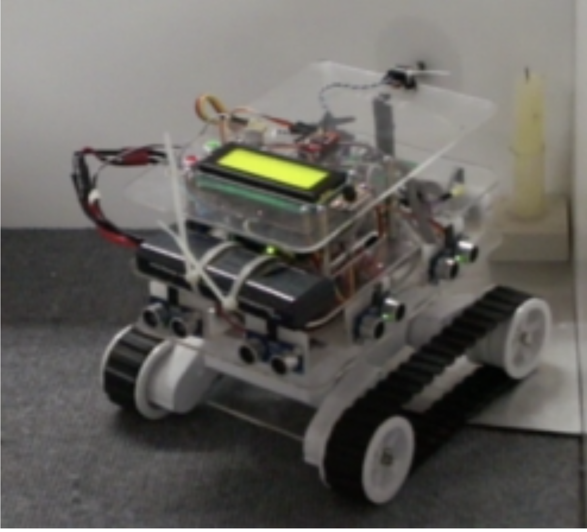
    

        

            A Fire Fighting Robot built when I was on University of BINUS Computer Engineering.
            This robot is for KRPAI Contest. It will search for fire in a room. Consist of UVtron sensor, 8 Parallax Ping sensors, 4 IR Sharp sensors, Gyroscope L3G4200D, servo, DC motors, motor driver, LiPo battery, atmega2560 as a main controller and atmega8 as a sensor controller.  
        

    

### **📁 OS-Wifanusa - RF Booster 30 Watt**

    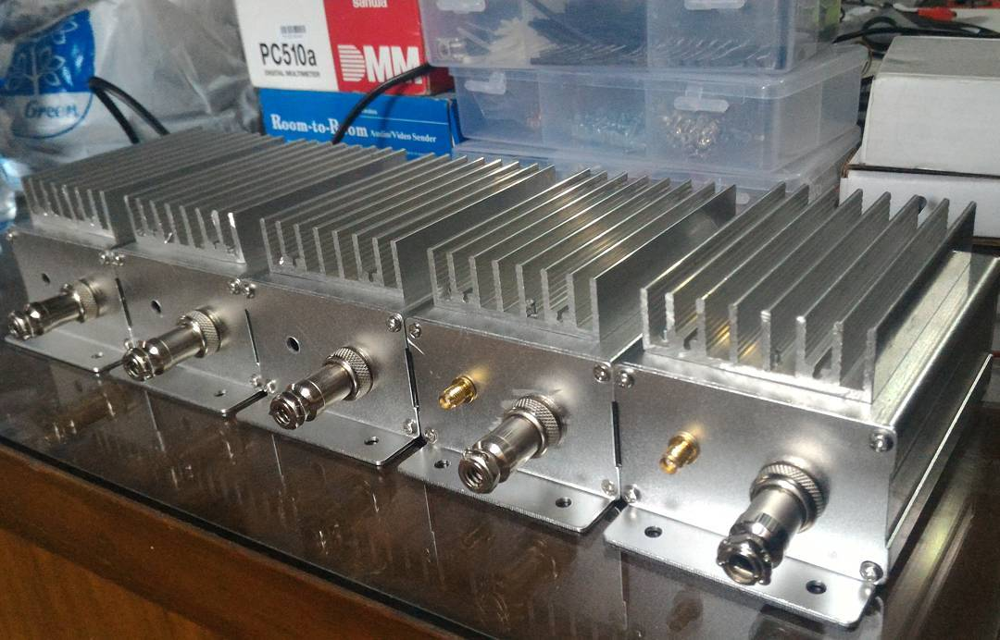
    

        

            A RF Booster for Long Range Drone.
            Consist of High Power 30 Watt RF amplifier IC to boost RF between 400 MHz - 470 MHz 
        

    

### **📁 Homebrew Partner - DDS Module Interface**

    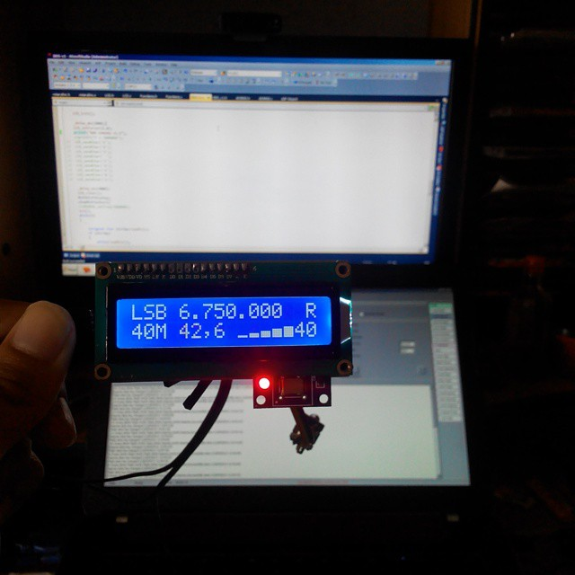
    

        

            An Interface for Amateur Radio.
            Consist of 16x2 display, atmega8 and DDS AD9850 for generating local oscillator. Programmed in C using Atmel Studio 
        

    

### **📁 SMAN 2 Depok - UAV**

    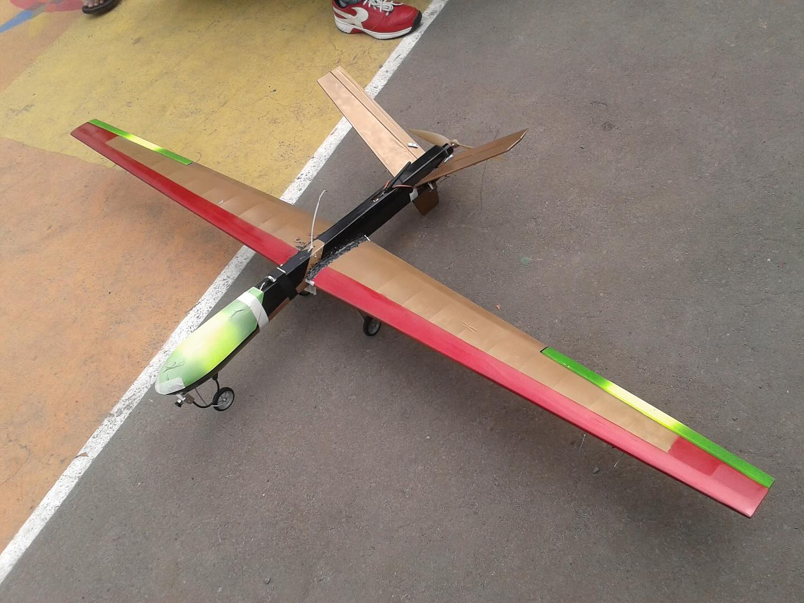
    

        

            A Fixwing UAV Drone, built when I was on Senior High School at SMAN 2 Depok for IARC Contest.
            This Drone equiped with brushless motor and 14 inch propeller. With 180cm wingspan to increase efficiency. With GNSS to be able to locate current position of the Drone. Equiped with FPV camera and capable to send realtime video.
        

    

---